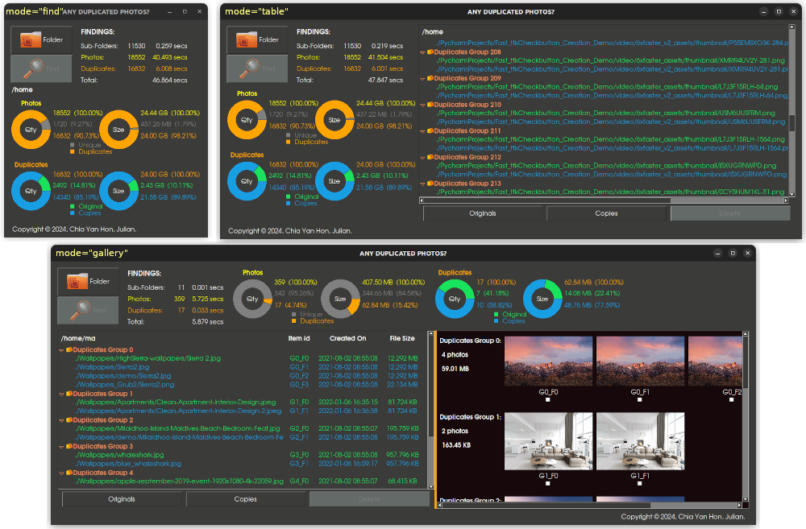

# adp.py

_ANY DUPLICATED PHOTOS?_ or _adp.py_ is a simple-to-use python module that let you quickly find and delete duplicated photos in a desktop/laptop.

## How To Install?
1. Clone/create this repository in your computer, e.g. 
    
       git clone https://github.com/JulianChia/adp.git

2. Go to the `adp` directory: 

       cd path/to/cloned/adp

3. (Recommended) Install the adp module using the `pipenv` command:  

       pipenv install

   `pipenv` must first be installed in your system; if not, you can install it following these [instructions](https://pipenv-fork.readthedocs.io/en/latest/install.html#installing-pipenv).

3. (Alternative) Install the adp module using the `pip` command : 

       pip install -r requirements.txt

## How To Use It?

1. You can run it <u>as an application</u> using the following terminal command with its optional arguments:

       python3 -m adp  [-m or --mode {f,t,g}]  Run in either 'f=find', 't=table' or 'g=gallery' mode.
                       [-l or --layout {h,v}]  Set GUI to use either a 'h=horizontal' or 'v=vertical' layout.
                       [-c or --cfe {p,t}]  Set the concurrent.future.Executor to either 'p=process' or 't=thread' type.
                       [-h]  Get help. 
       
       Examples:
         python3 -m adp -m f                            # in "find" mode
         python3 -m adp -m t                            # in "table" mode
         python3 -m adp  or  python3 -m adp -m g        # in "gallery" mode

2. You can use it <u>as a library</u> by importing the relevant class or functions into your python script: 

       from adp import {class or function}

   **Accessible classes:**

       Custom tkinter.ttk widgets: 'ADPFind', 'ADPGallery', 'ADPTable', 'AutoScrollbar', 'DonutCharts', 'DupGroup', 'Find', 'Findings', 'Gallery', 'Progressbarwithblank', 'Table', 'VerticalScrollFrame'
       Others:                     'HyperlinkManager', 'RasterImage'

   **Accessible functions:**

       For working with tkinter.ttk widgets: 'customise_ttk_widgets_style', 'get_geometry_values','get_thumbnail', 'get_thumbnails_concurrently_with_queue', 'filesize', 'sort_photos_by_creation_time', 'str_geometry_values', 'string_pixel_size', 'stylename_elements_options', 'timings'  
       For finding sub-directories:          'fast_scandir'
       For finding photos:                   'dataklass', 'fast_scandir', 'rscandir_images', 'scandir_images', 'scandir_images_concurrently', 'tuple_rscandir_images', 'tuple_scandir_images'  
       For detecting duplicated photos:      'detect_duplicates_concurrently', 'detect_duplicates_serially'
   Please refer to the source codes for their details.

## Operating Systems (OS):
- Linux (tested on Ubuntu 22.04.4, Linux 6.5.0-26-generic, x86_64)
- Windows and MacOS (not tested)

## Softwares:
- Required: _Python >=3.10_. 
- Dependencies: _NumPy 1.26.4_, _Pillow 10.2.0_ and Tk 8.6.

