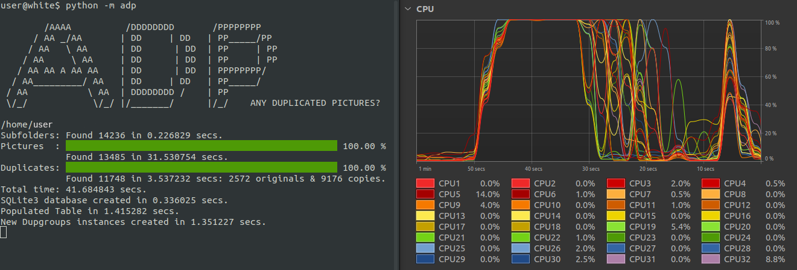

# ADP

_"ANY DUPLICATED PICTURES"_ / `ADP` / `adp` is a simple-to-use application that let's you quickly find and delete duplicated picture files in a desktop/laptop. It is fast because concurrent programming is used in addition to its fast picture recognition capability. All you have to do is click the <kbd>Folder</kbd> button to select a folder that you want to search, followed by a click on the <kbd>Find</kbd> button to search the folder and all its subfolders for duplicated pictures. Once completed, you can click on the duplicated pictures you want to delete and finally click on the <kbd>Delete</kbd> button to delete them.

User notes: 
1. _'Original'_ denotes the earliest version of a duplicate picture and is colour coded in green. _'Copies'_ denotes its later versions and is colour coded in blue. Clicking the <kbd>Originals</kbd> or <kbd>Copies</kbd> buttons toggles their quick selection/deselection.
2. The maximum _'Duplicates Group'_ number is always one less the quantity of _'Original'_ pictures.
3. To manually select/deselect multiple picture files, press the <kbd>Shift</kbd> key in your keyboard followed by clicking the first and last file paths with your mouse pointer. You can also select/deselect a single picture file by clicking on its filepath or thumbnail-image.
4. `ADP` defaults to using a pool of your CPU logical cores (i.e. process-pool or `cfe=process`) vs a pool of CPU threads (i.e. thread-pool or `cfe=thread`) to find pictures and their duplicates. This is one of the main reason why ADP is fast. You can visualise its performance when you run ADP via a terminal and use a system monitor or tasks manager tool, if need, as shown below:  
   

     
   

5. The diagram below illustrates just how much faster ADP can be when using many logical cores vs 1 logical core to find pictures and their duplicates in a NVMe.m.2 solid-state-drive (SSD). The contrast of faster performance is most obvious when large quantities of large pictures(i.e, high resolution pictures) and their duplicates are processed. Consequently, ADP defaults to using all logical cores of a CPU.
   

     
   

6. If your pictures are in a traditional hard disk (HDD), it is recommended that you transfer your pictures to a SSD before using ADP to search out picture duplicates. This is because the performance of a HDD is snail pace compared to a SSD and the high performance from using process or thread pool will be mitigated by the HDD. Moreover, ADP is set to timeout if a search for pictures or picture duplicates exceeds 10 minutes. 

## Sponsor This App
If you like this app, please : .

## How To Install and Run ADP?

### Option 1:
- To install ADP on any x86_64 Linux distros, you can simply download this [adp_ver011-x86_64.AppImage](https://github.com/JulianChia/Repository/blob/main/Assets/adp_ver011-x86_64.AppImage) file and give it execution permission. 
- To run/use it, you can either click on the `adp_ver011-3.10.14-x86_64.AppImage` file with your mouse pointer or run this command `./adp_ver011-x86_64.AppImage` on a terminal.

### Option 2
For x86_64 Linux, Mac and Windows operating systems installed with `Python =>3.10`, you can install `ADP` by following these steps:
   1. Clone this repository into your computer. 
      1. You can download a zipped version of ADP by pressing the <kbd>Code</kbd> button on this webpage and then extract the `adp` folder into your computer. 
      2. Alternatively, you can issue this command in your terminal: 
    
             git clone https://github.com/JulianChia/ADP.git

   2. Next, go to your cloned local `ADP` directory, e.g.: 

          cd path/to/your/cloned/ADP/directory

   3. Install the cloned `adp` module, its `virtualenv` and dependencies (`Numpy v1.26.4` and `Pillow v10.2.0`) using this `pipenv` command:  

          pipenv sync

      Note: This command ensures that the above mentioned packages resides only in your user account and does not affect or depend on any other already installed package(s) in your system. The `pipenv` package must first be installed in your system. If it isn't, you can install `pipenv` following these [instructions](https://pipenv-fork.readthedocs.io/en/latest/install.html#installing-pipenv).

   1. You can issue the following terminal command (with/without its optional arguments) from the adp folder:

          $ pipenv run python3 -m adp  [-m or --mode {g,t,f}]  # Run in either 'gallery', 'table' or 'find' mode. Default is 'gallery'.
                                  [-l or --layout {h,v}]  # Set GUI to use either a 'horizontal' or 'vertical' layout. Default for `gallery` and `table` modes is 'horizontal'. 'find' mode allows 'only vertical' layout. 
                                  [-c or --cfe {p,t}]     # Use CPU 'process' or 'thread' pool for execution. Default is 'process'.
                                  [-h]                    # Get help. 
       
          Examples:
          $ pipenv run python3 -m adp           # default options: adp -m g -l h -c p 
          $ pipenv run python3 -m adp -m t      # in 'table' mode
          $ pipenv run python3 -m adp -m f      # in 'find' mode

## Operating Systems (OS):
- Linux (tested on Ubuntu 22.04.4, Linux 6.5.0-26-generic, x86_64)
- MacOS (tested on Catalina 10.15, Darwin 19.6.0, x86_64)
- Windows (not tested but should work; please alert me of any issue.)

## Softwares:
- Required: _Python >=3.10_. 
- Dependencies: _NumPy 1.26.4_, _Pillow 10.2.0_ and _Tk 8.6_. . 

## Notes To Python Programmers:

1. You can use the `adp` module in `ADP` <u>as a library</u>. To access its classes and/or functions in your python script, copy the `adp` module to your project and use the command: 

       from adp import (classes and/or functions)

   **Accessible classes:**

       Widgets:       ADP, ADPFind, ADPGallery, ADPTable, About, AutoScrollbar, DonutCharts, DupGroup, Find, Findings, Gallery, Progressbarwithblank, Table, VerticalScrollFrame
       For picture:   RasterImage,
       For internet:  HyperlinkManager

   **Accessible functions:**

       For widgets:      customise_ttk_widgets_style, filesize, get_geometry_values, get_thumbnail, get_thumbnail_c, get_thumbnails_concurrently_with_queue, pop_kwargs, sort_pictures_by_creation_time, str_geometry_values, string_pixel_size, stylename_elements_options, timings
       Find subfolders:  fast_scandir
       Find pictures:    dataklass, get_filepaths_in, get_image, get_rasterimages_in_one_folder_concurrently, list_scandir_images, scandir_images, scandir_images_concurrently
       Find duplicates:  detect_duplicates_concurrently, detect_duplicates_serially
       For terminal:     main, percent_complete, show_logo_in_terminal
   Please refer to the source codes for their details.
2. Python script highlights:
   1. Algorithm to search out pictures and their duplicates quickly.
   2. A paging system to view searched results in tkinter widgets with the mousewheel without overflowing memory and with minimal lag.
   3. Stable integration of Python's `threading.Thread`, `concurrent.futures.ProcessPoolExecutor` and `concurrent.futures.ThreadPoolExecutor` objects with tkinter's main event loop. 

